# 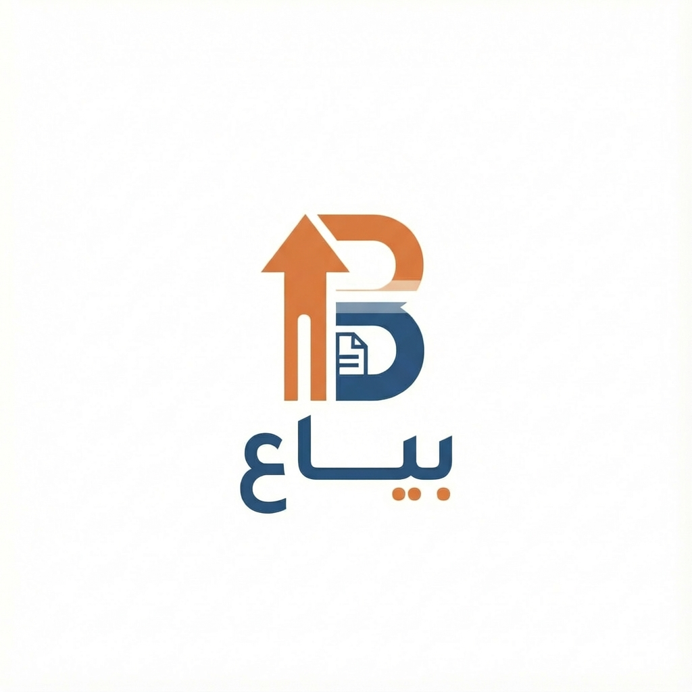 Bayaa POS


[](https://flutter.dev)
[](https://dart.dev)
[](LICENSE)
[](https://flutter.dev/desktop)

**Professional Point of Sale & Management System**  
*Powering modern retail businesses with speed, reliability, and insight.*

---

## 🚀 Overview

**Bayaa** is a comprehensive Desktop POS and ERP solution designed for high-performance retail environments. Built with **Flutter**, it delivers a seamless, offline-first experience that empowers store managers to handle sales, inventory, and analytics with precision.

Tailored for **Mobile Phone Stores** and retail outlets, Bayaa combines a beautiful modern UI with robust backend logic using Clean Architecture.

---

## ✨ Key Features

### 💰 Sales & Point of Sale
*   **Fast Checkout:** Streamlined sales process with barcode scanning or manual entry.
*   **Smart Invoicing:** Generate professional A4 invoices and 80mm thermal receipts.
*   **Refund Management:** Handle returns and refunds with strict stock validation.
*   **Session Management:** Secure shift closing with detailed daily reports.

### 📦 Inventory & Stock Control
*   **Real-time Tracking:** Monitor stock levels instanly.
*   **Low Stock Alerts:** Automated warnings for products running low.
*   **Product Management:** Easy CRUD operations for thousands of SKUs.

### 📊 Analytics & Reporting
*   **Daily Sales Reports:** Comprehensive breakdown of revenue, profit, and top-selling items.
*   **Visual Insights:** Interactive charts and graphs for business performance.
*   **Session History:** Audit logs of previous shifts and transactions.

### 🛡️ System & Security
*   **Role-Based Access:** Distinct permissions for Managers and Cashiers.
*   **Offline-First:** Built on **Hive** for zero-latency local database performance.
*   **Secure:** Data privacy and local storage focus.

---

## 🏗️ Technical Architecture

Bayaa is built using industry-standard **Clean Architecture** principles to ensure scalability and maintainability.

| Layer | Technology |
|-------|------------|
| **Framework** | Flutter (Windows Desktop) |
| **Language** | Dart |
| **State Management** | BLoC / Cubit |
| **Dependency Injection** | GetIt & Injectable |
| **Local Database** | Hive (NoSQL) |
| **Printing** | PDF & Printing Packages |
| **Navigation** | Clean Routing |

---

## 📸 Screenshots

### 🖥️ General
| Login Screen | Sales Interface |
|--------------|-----------------|
| 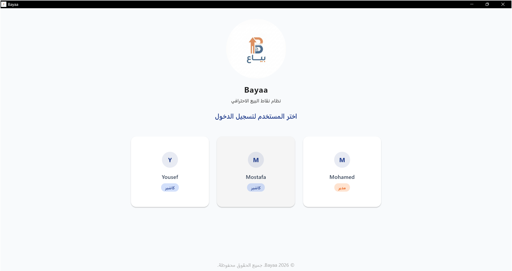 | 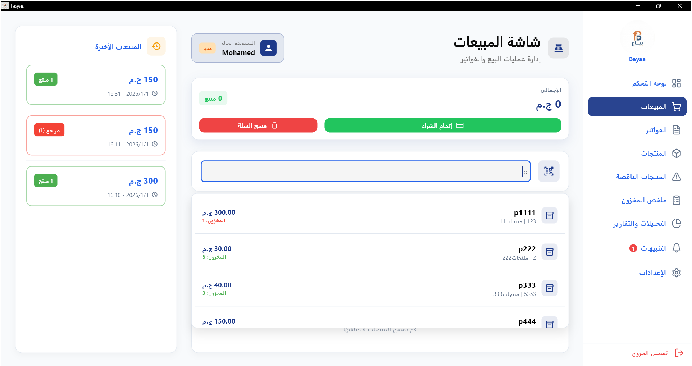 |

### 👨‍💼 Manager Interface
| Manager Dashboard | Products Management |
|-------------------|-------------------|
| 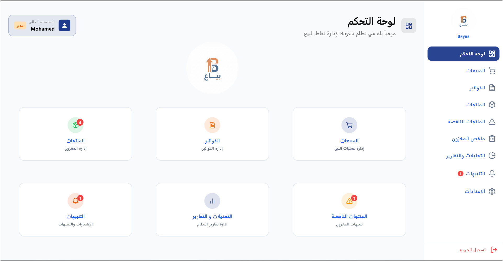 | 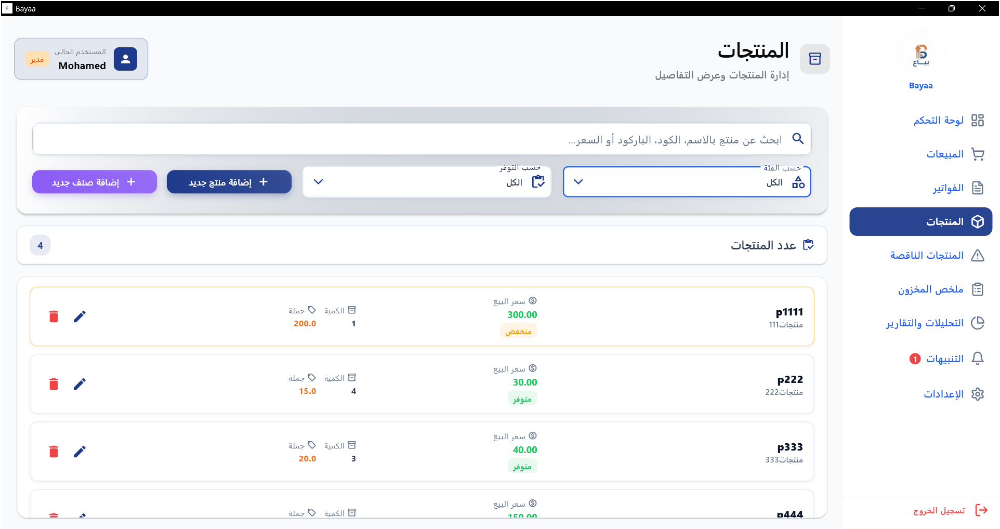 |

| Invoices History | Daily Reports |
|------------------|---------------|
| 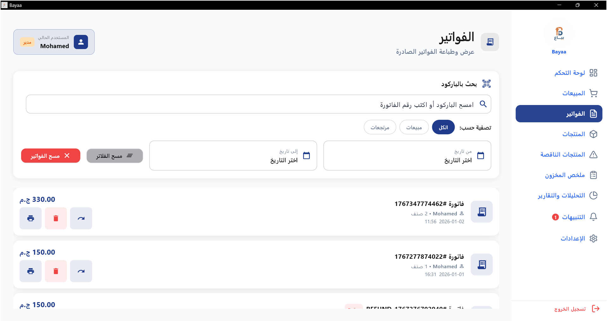 | 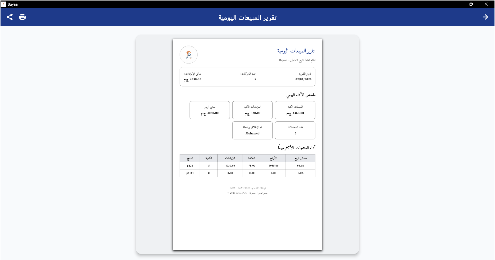 |

| Stock Summary | Refund Management |
|---------------|-------------------|
| 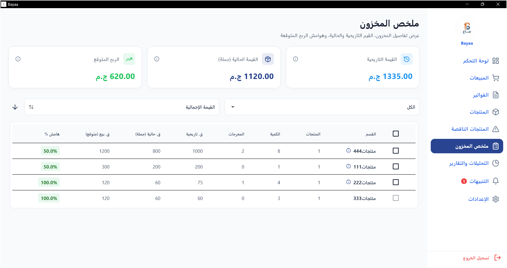 | 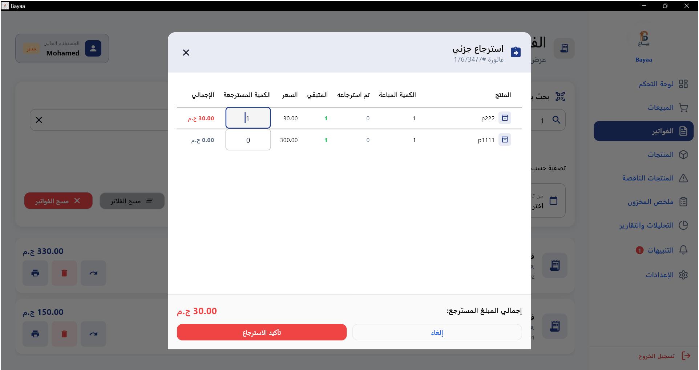 |

### 👨‍💻 Cashier Interface
| Cashier Dashboard | Cashier Sales |
|-------------------|---------------|
| 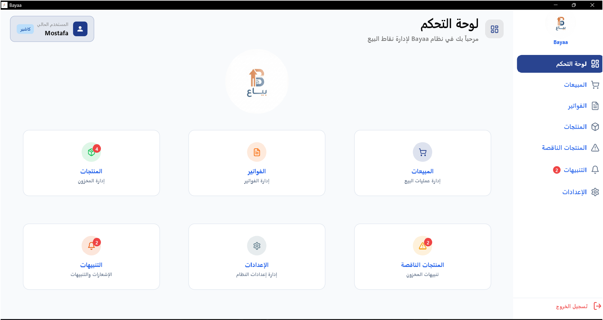 | 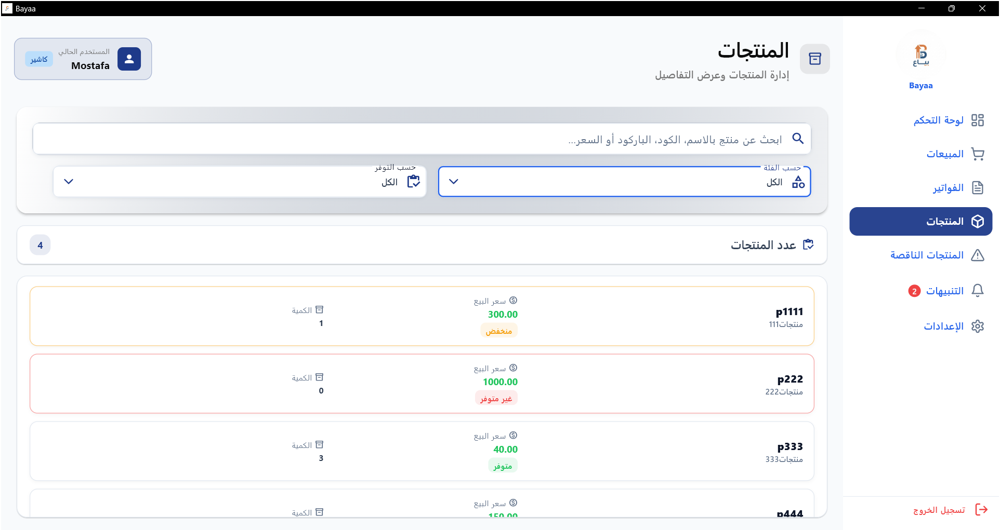 |

---

## 🚀 Getting Started

### Prerequisites
*   Windows 10/11
*   Flutter SDK (3.x+)
*   Visual Studio (C++ Desktop Development workload)

### Installation
```bash
# 1. Clone the repository
git clone https://github.com/Desha29/Bayaa.git

# 2. Navigate to project directory
cd Bayaa

# 3. Install dependencies
flutter pub get

# 4. Run the application
flutter run -d windows
```

---

## 📄 License
This project is proprietary software. All rights reserved.
© 2026 **Bayaa Systems**.

---

<center>
  <sub>Built with ❤️ by <a href="https://github.com/Desha29">Mostafa Amr</a></sub>
</center>
